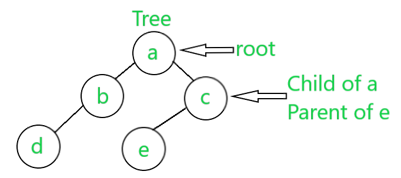
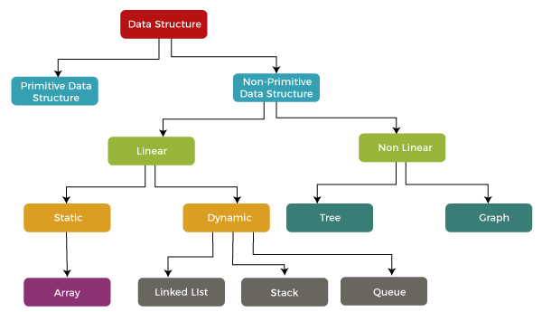

# Introduction
A data structure is a storage that is used to store and organize data. It is a way of arranging data on a computer so that it can be accessed and updated efficiently.

## Classification of Data Structures

Data structures can be categorized into various types based on their characteristics, behavior, and usage. They are broadly classified into two main categories: **primitive** and **non-primitive** data structures.

## Primitive Data Structures

Primitive data structures are the fundamental building blocks of data manipulation. They include:

### 1. Integer
   - Stores whole numbers (positive, negative, or zero).
   - Examples: `int` in C, `int` in Java.

### 2. Floating-Point
   - Stores real numbers with decimal points.
   - Examples: `float` and `double` in C, `float` and `double` in Java.

### 3. Character
   - Stores individual characters or symbols.
   - Examples: `char` in C, `char` in Java.

### 4. Boolean
   - Stores true or false values.
   - Examples: `bool` in C++, `boolean` in Java.

## Non-Primitive Data Structures

Non-primitive data structures are more complex and are built using primitive data types. They can further be classified into **linear** and **non-linear** data structures.

### Linear Data Structures

Linear data structures organize data in a sequential manner where each element has a unique predecessor and successor.

#### 1. Array
   - Description: Stores a collection of elements of the same data type.
   - Example: `int[] numbers = {1, 2, 3, 4, 5};`
   - Application: Storing a list of student grades.

#### 2. Linked List
   - Description: Organizes elements as nodes with data and references to the next node.
   - Example: Implementation of a singly linked list in a programming language.
   - Application: Managing a playlist of songs.

#### 3. Stack
   - Description: Follows the Last-In-First-Out (LIFO) principle.
   - Example: Function call stack during recursive function execution.
   - Application: Evaluating mathematical expressions.

#### 4. Queue
   - Description: Follows the First-In-First-Out (FIFO) principle.
   - Example: Print queue for a printer.
   - Application: Task scheduling in an operating system.

### Non-Linear Data Structures

Non-linear data structures organize data in a hierarchical or interconnected manner without a sequential order.

#### 1. Tree
   - Description: Hierarchical structure with a root node and child nodes.
   - Example: Binary search tree for efficient searching.
   - Application: Organizing a directory structure.

#### 2. Graph
   - Description: Represents a set of vertices connected by edges.
   - Example: Social network graph with users as nodes and friendships as edges.
   - Application: Modeling relationships in a social network.

#### 3. Hash Table
   - Description: Stores key-value pairs for efficient data retrieval.
   - Example: Storing username-password pairs for user authentication.
   - Application: Implementing a dictionary or a phone book.

#### 4. Heap
   - Description: Special tree-based structure used in priority queues.
   - Example: Min Heap for scheduling tasks with varying priorities.
   - Application: Priority-based scheduling in an operating system.

---

This hierarchical classification, along with examples and applications, provides a comprehensive view of various data structures and their practical use cases.

