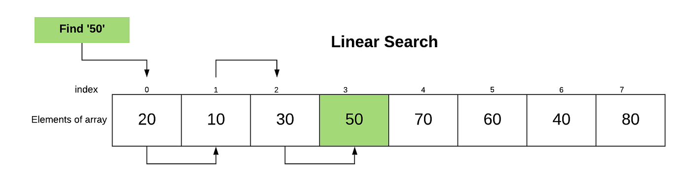
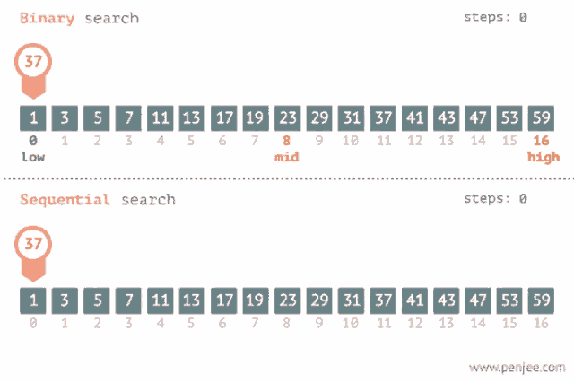

# Array Searching 

Searching Algorithms are designed to check for an element or retrieve an element from any data structure where it is stored.




Based on the type of search operation, these algorithms are generally classified into two categories:

    - Linear Search 
    - Interval Search


## Linear Search 


Linear Search is defined as a sequential search algorithm that starts at one end and goes through each element of a list until the desired element is found, otherwise the search continues till the end of the data set.


### How linear search works ?


List: [10, 14, 18, 26, 31, 33, 35, 42, 44]

Finding 33 in a List


**Steps:**

1. **Start at the beginning:** Begin by looking at the first number, which is 10.

2. **Check each number:** Move through the list one by one.

3. **Match found:** At the 6th number, which is 33, a match is found!

4. **Stop:** The search stops since the desired number has been found.


```python
def find(arr: list, key: int) -> int:
    """
    Performs a linear search to find a key in the given array.
    Parameters:
    arr (list): The list of elements to search through.
    key (int): The element to search for in the array.
    
    Returns:
    int: The index of the key if found, -1 if not found.
    """
    for i in range(0, len(arr)):  # Loop through each index in the array.
        if arr[i] == key:  # Compare the element at the current index with the key.
            return i  # If a match is found, return the index.
    return -1  # If the loop completes without finding a match, return -1.

# Example usage
array = [10, 14, 18, 26, 31, 33, 35, 42, 44]
search_key = 33
print(find(array, search_key))

```

    5
    


### Linear Search Complexity Analysis

- **Best Case Complexity:** In the best case, the desired element is the first element in the list. This results in only one comparison, making the best-case time complexity **O(1)**.

- **Average Case Complexity:** On average, in an unordered list, you might need to search through half of the list's elements before finding the target element. This leads to an average time complexity of **O(n/2)**, which simplifies to **O(n)**.

- **Worst Case Complexity:** In the worst case, you might need to search through all the elements in the list before finding the target or concluding that it's not there. The worst-case time complexity is **O(n)**, where **n** is the number of elements in the list.

- **Space Complexity:** Linear search doesn't require additional data structures, resulting in a space complexity of **O(1)**, indicating a constant memory usage.

### Advantages 
    - Linear search can be used irrespective of whether the array is sorted or not. It can be used on arrays of any data type.
    - Does not require any additional memory.
    - It is a well-suited algorithm for small datasets.


### Disadvantages
    - Linear search has a time complexity of O(N), which in turn makes it slow for large datasets.
    - Not suitable for large arrays.


### When to use ?
    - When we are dealing with a small dataset.
    - When you are searching for a dataset stored in contiguous memory.


## Interval search
These algorithms are specifically designed for searching in sorted data-structures. These type of searching algorithms are much more efficient than Linear Search as they repeatedly target the center of the search structure and divide the search space in half. For Example: Binary Search.


### Binary Search

Binary Search is defined as a searching algorithm used in a sorted array by repeatedly dividing the search interval in half. The idea of binary search is to use the information that the array is sorted and reduce the time complexity to O(log N). 


## How binary search works ?




 Binary Search for 37

**List:** 1, 3, 5, 7, 9, 11, 13, 15, 17, 19, 23, 29, 31, 37, 35, 43, 47, 53, 59

**Steps:**

1. **Start in the Middle:** You start by looking at the middle number, which is 19.

    <details>
    <summary>Click to expand: How to Calculate the Middle Number</summary>

    **Calculating the Middle Number:**

    To find the middle number for binary search:

    1. Identify the index of the first number in your range.
    2. Identify the index of the last number in your range.
    3. Add the index of the first number to the index of the last number.
    4. Divide the sum by 2.
    5. The result is the index of the middle number.

    For example, in the list `[1, 3, 5, 7, 9, 11]`:

    - First number index: 0
    - Last number index: 5
    - (0 + 5) // 2 = 2

    Since indices are whole numbers, the middle number is the element at index 2: 5.

    </details>

    

2. **Compare with 37:** You compare 19 with 37. Since 37 is greater than 19, you know you should look to the right.

3. **New Middle:** You now focus on the right half of the list: 23, 29, 31, 37, 35, 43, 47, 53, 59.

4. **Compare with 37 Again:** You compare the middle number, which is 35, with 37. This time, 37 is greater than 35, so you keep moving to the right.

5. **New Middle:** You're now left with 37, 43, 47, 53, 59.

6. **Found!:** The middle number is 37, which is exactly what you were searching for! You found it.


```python
array = [1, 3, 5, 7, 9, 11, 13, 15, 17, 19, 23, 29, 31, 37, 35, 43, 47, 53, 59]

def binary_find(arr:list,key:int,start:int,end:int)->int:
    while start <= end:
        mid = (start+end)//2
        if arr[mid] == key:
            return mid
        elif arr[mid]>key:
            end -= 1
        elif arr[mid]<key:
            start+= 1    

print(binary_find(array,37,0,len(array)-1))
```

    13
    


### Complexity Analysis

- Time Complexity: O(log n)
- Space Complexity: O(1)

Binary search reduces the search space by half with each comparison, leading to a logarithmic growth rate in relation to the size of the array.

### Advantages

- **Efficiency**: Binary search is highly efficient, making it ideal for large datasets. Its logarithmic time complexity ensures rapid convergence to the target element.

- **Applicability**: Binary search is specifically designed for sorted arrays. If the data is presorted, binary search provides a significant performance advantage over linear search.

- **Deterministic**: Binary search guarantees a definite result – either the target element is found, or it's determined that the element doesn't exist in the array.

### Disadvantages

- **Sorted Array Requirement**: Binary search only works on sorted arrays. If the data isn't sorted, you'd need to sort it first, which could add an O(n log n) step.

- **Space Overhead**: Binary search requires minimal additional memory (O(1)) for its iterative implementation. However, recursive implementations may lead to space overhead due to the call stack.

- **Lack of Flexibility**: Binary search doesn't adapt well to dynamic or frequently changing data.

### When to Use Binary Search

- **Sorted Data**: Binary search is most effective when working with sorted data. If the data can be maintained in a sorted order, binary search offers a significant advantage over linear search.

- **Large Datasets**: When dealing with large datasets, binary search's logarithmic time complexity outperforms linear search's linear time complexity.

- **Predetermined Ordering**: When the data access pattern is known and doesn't involve frequent insertions or deletions, binary search can be highly efficient.


<details>
  
<summary>Click to expand:  Searching Algorithms</summary>

 The "best" searching algorithm depends on the specific context and requirements of the search problem. Different algorithms have different strengths and weaknesses, and the choice of algorithm often depends on factors like the size of the dataset, the nature of the data, and the trade-off between time complexity and space complexity. Here are a few commonly used searching algorithms and their characteristics:

1. **Linear Search**: This is the simplest searching algorithm, where each element in the list is checked one by one until the target element is found or the list is exhausted. It works well for small datasets, but its time complexity is O(n) in the worst case, where n is the number of elements in the list.

2. **Binary Search**: Binary search is highly efficient but requires a sorted list. It works by repeatedly dividing the search interval in half. It has a time complexity of O(log n), making it suitable for large datasets.

3. **Hashing**: Hashing involves mapping keys to indices in an array using a hash function. If implemented properly, hash-based searching can have an average-case time complexity of O(1), making it extremely fast. However, handling collisions and choosing a good hash function can be challenging.


    **Note** : Must checkout hashing if want to search in unsorted array


4. **Jump Search**: Jump search is similar to binary search but works on a sorted block of data. It jumps ahead by a fixed number of steps, and when a value greater than the target is found, it performs a linear search within the block. It combines aspects of linear and binary search algorithms.

5. **Interpolation Search**: This algorithm works best for uniformly distributed sorted datasets. It estimates the position of the target element based on its value and the distribution of the data, which can result in faster convergence than binary search for some datasets.

6. **Exponential Search**: Exponential search is especially useful when the target element lies towards the beginning of a sorted list. It involves doubling the search range until an interval containing the target element is found, and then performing a binary search within that interval.

7. **Ternary Search**: Ternary search is similar to binary search but divides the dataset into three parts instead of two. It can be effective in cases where the data has a "peak" or "valley" pattern.

8. **Fibonacci Search**: This is a variant of binary search that divides the dataset into Fibonacci-number-sized subarrays. It can be useful for large datasets where the size is not known in advance.

The "best" algorithm depends on your specific use case. For example, if you have a small dataset, a linear search might be sufficient. If you have a large sorted dataset, binary search or interpolation search could be more appropriate. If you have a hash table available, hashing might provide fast access. Always consider the characteristics of your data and the requirements of your search when selecting an algorithm.
 
 </details>
    


Q1 . Given an array with all distinct elements, find the largest three elements. Expected time complexity is O(n) and extra space is O(1). 


```python
arr  = [10,4,3,50,23,90]
# using linear search 

def findLargest(arr:list)->tuple:
    first = second = third = 0
    for i in range (0,len(arr)):
        if (arr[i] > first):
            third = second
            second = first
            first =arr[i]
        elif (arr[i] > second):
            third = second
            second = arr[i]
        elif (arr[i]>third):
            third = arr[i]
    return (third,second,first)

print(findLargest(arr))        
```

    (23, 50, 90)
    

Q2 . Given an array arr[] of size N-1 with integers in the range of [1, N], the task is to find the missing number from the first N integers.

```python
 arr = [1,2,4,6,3,7,8]
 N = 8
 output = 5 
```

*Explanation: The missing number between 1 to 8 is 5*


```python
# By adding every number
def checkMissingNumber(arr:list,n:int)->int:
    sum = n*(n+1)//2
    listSum = 0
    for i in range(0,len(arr)+1):
        listSum+=i
    return sum -listSum

arr = [1,2,4,6,3,7,8]
N = 8
print(checkMissingNumber(arr,N))
```

    8
    

Q3. Given an array of integers arr[], The task is to find the index of first repeating element in it i.e. the element that occurs more than once and whose index of the first occurrence is the smallest. 


```python
Input: arr[] = {10, 5, 3, 4, 3, 5, 6}
Output: 5 
```
*Explanation: 5 is the first element that repeats*


```python
# find repeating element
def findRepeatingElement(arr:list)->int:
    for i in range(0,len(arr)):
        for j in range(i+1,len(arr)):
            if arr[j] == arr[i]:
                return arr[i]
    return -1 
arr =  [10, 5, 3,4, 3, 5, 6]  
print(findRepeatingElement(arr))
```

    5
    

However the above approach is not so efficient so i wont recommend this also uses two loops, instead you can see the below approach which utilses `Set`. [Set]("https://www.w3schools.com/python/python_sets.asp") is a collection data type which has property of storing one unique elements. searching for item inside set is not performed linearly it uses hashing hence time complexity of O(1) which makes this approach more efficient even dealing with larger arrays


```python
def findRepeatingElemenUsingSet(arr:list)->int:
    items = set()
    for element in arr:
        if element in items:
            return element
        else :
            items.add(element)    

    return -1        
arr =  [10, 5, 3,4, 3, 5, 6]  
print(findRepeatingElement(arr))

```

    5
    

Q4. Given a binary array arr[] of size N, which is sorted in non-increasing order, count the number of 1’s in it. 

```python
Input: arr[] = {1, 1, 0, 0, 0, 0, 0}
Output: 2

Input: arr[] = {1, 1, 1, 1, 1, 1, 1}
Output: 7
```


```python
# Using binary Search instead of linear search 
def countOnes(arr:list)->int:
    start = 0
    end = len(arr) -1
    while start <= end:
        mid = (start + end)//2
        if arr[mid] == 1 and  arr[mid+1] == 0:
            return mid + 1
        elif arr[mid] == 1 and arr[mid+1]!= 0:
            start = mid + 1
        elif arr[mid] == 0 :
            end = mid -1
        

arr = [0,0,0,0,0,0,0]
for i in range(100):
    arr.insert(0,1)  
print(arr.count(1))
print(countOnes(arr))     
```

    100
    100
    
